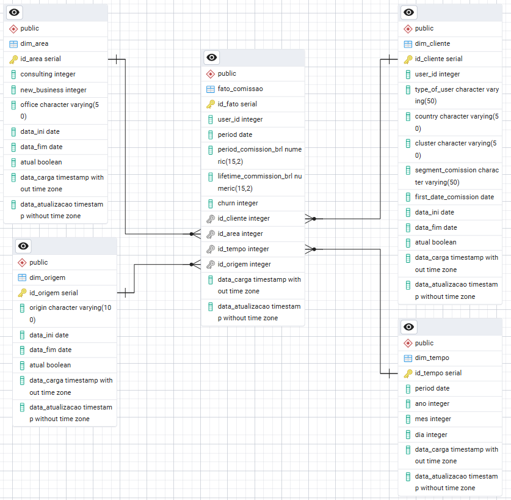

# Teste Prático - Analista de BI I
<a href="https://mendesrafael965.github.io/teste_pratico_analista_bi_I/"> Link para página do projeto</a>
<h2>Estrutura do ETL</h2>

  Considerando o detalhamento da base de dados fornecido no roteiro para o teste prático que é apresentado na figura abaixo.

 

