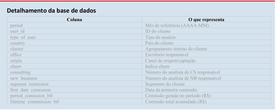

# Teste Prático - Analista de BI I
<a href="https://mendesrafael965.github.io/teste_pratico_analista_bi_I/"> Link para página do projeto</a>
<h2>Estrutura do ETL</h2>

  Considerando o detalhamento da base de dados fornecido no roteiro para o teste prático que é apresentado na figura abaixo.

 

  E os requisitos:

 
<ul>
  <li>Implementar Slowly Changing Dimensions (SCD Tipo 2) para as dimensões; </li>
  <li>Adicionar colunas de auditoria: data_carga, data_atualizacao.</li>
</ul>
  Foram definidas as seguintes dimensões.
<h2>dim_cliente</h2>
<ul>
    <li>id_cliente (PK)</li>
    <li>user_id (NK)</li>
    <li>type_of_user</li>
    <li>country</li>
    <li>cluster</li>
    <li>segment_comission</li>
    <li>first_date_comission</li>
    <li>data_ini</li>
    <li>data_fim</li>
    <li>atual</li>
    <li>data_carga</li>
    <li>data_atualizacao</li>
</ul>

<h2>dim_area</h2>
<ul>
    <li>id_area (PK)</li>
    <li>consulting</li>
    <li>new_business</li>
    <li>office</li>
    <li>data_ini</li>
    <li>data_fim</li>
    <li>atual</li>
    <li>data_carga</li>
    <li>data_atualizacao</li>
</ul>

<h2>dim_tempo</h2>
<ul>
    <li>id_tempo (PK)</li>
    <li>period</li>
    <li>ano</li>
    <li>mês</li>
    <li>dia</li>
    <li>data_carga</li>
    <li>data_atualizacao</li>
</ul>

<h2>dim_origem</h2>
<ul>
    <li>id_origem (PK)</li>
    <li>origin</li>
    <li>data_ini</li>
    <li>data_fim</li>
    <li>atual</li>
    <li>data_carga</li>
    <li>data_atualizacao</li>
</ul>

<h2>fato_comissao</h2>
<ul>
    <li>id_fato (PK)</li>
    <li>user_id</li>
    <li>period</li>
    <li>period_comission_brl</li>
    <li>lifetime_commission_brl</li>
    <li>churn</li>
    <li>id_cliente (FK)</li>
    <li>id_area (FK)</li>
    <li>id_tempo (FK)</li>
    <li>id_origem (FK)</li>
    <li>data_carga</li>
    <li>data_atualizacao</li>
</ul>

  Sendo os campos <b>data_ini</b>, <b>data_fim</b> e atual utilizados para garantir rastreabilidade do histórico completo de alterações em atributos das dimensões. Já os campos <b>data_carga</b> e <b>data_atualizacao</b> são utilizados para auditorias.

 

  O <a href="https://github.com/mendesrafael965/teste_pratico_analista_bi_I/blob/main/make%20db.sql"> arquivo</a> contém as instruções utilizadas para criar o banco de dados. Já a figura abaixo apresenta o modelo após criadas as tabelas e seus relacionamentos no banco de dados PostgreSQL.

 

<h2>Dashboard (Somente iniciado)</h2>

    Visuais e indicadores em construção. Para construção do layout foi utilizada a ferramenta <b>Figma</b>.

 
